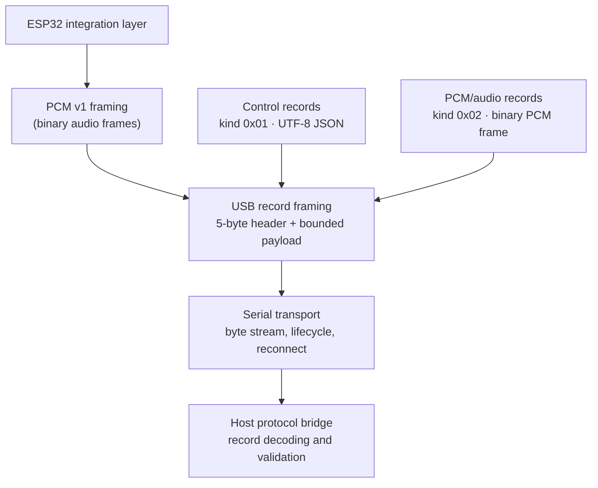

[简体中文](./README.zh-CN.md)

# ESP32 USB Voice Terminal

**An ESP32-S3 hardware project that gives desktop AI an independent, physical voice terminal.**

The completed original system previously established this real hardware end-to-end product loop:

**Microphone → ESP32-S3 → USB → Desktop → ASR → AI/Agent → TTS → USB → ESP32-S3 → Speaker**

The core engineering challenge is keeping continuous audio and control messages dependable while they share one USB byte stream: bounded framing, recovery from fragmented or coalesced reads, explicit device lifecycle behavior, and host-side testability without a physical device.

This repository is the public engineering version extracted from that completed private system: a reference implementation of the reusable binary framing, USB serial transport, protocol boundaries, and Node.js host-side reliability core. The complete desktop AI application, ASR/TTS integrations, and production configuration are intentionally not included.

Its current automated verification is **OFFLINE**. The real hardware loop above is historical private-system evidence only; it is not current hardware acceptance for this public repository.

## Architecture



The USB record boundary keeps control records and PCM/audio records distinct while allowing them to share the same serial byte stream. The host bridge decodes records incrementally, validates v1 control envelopes, and dispatches control and PCM payloads separately.

## Engineering value

- **Binary record framing:** a 5-byte, length-prefixed USB record envelope separates control (`0x01`) from PCM (`0x02`) data and enforces a 1024-byte payload limit.
- **Streaming decoder behavior:** the host decoder buffers fragmented headers and payloads, emits coalesced complete records in wire order, retains a partial tail, and rejects malformed record metadata.
- **Protocol boundary validation:** versioned JSON control envelopes and fixed-layout, little-endian PCM v1 frames validate version, type, framing, and payload length before use.
- **Firmware/host contract:** portable C++ firmware-integration sources and Node.js host sources share the documented v1 constants, capture/playback PCM profiles, and USB record model.
- **Host transport lifecycle:** the generic transport normalizes serial paths, serializes writes, reports errors, and handles intentional close versus deterministic reconnect after an unexpected failure.
- **Reset-strategy abstraction:** the generic transport has no default control-line behavior; a caller can inject a hardware-specific reset strategy without placing that assumption in the protocol layer.
- **Offline testability:** fake serial ports, injected reset strategies, and injected command execution make protocol and transport behavior testable without opening a physical device.

## What this repository includes

- v1 control, PCM, and USB record format documentation;
- portable C++ protocol and record-framing sources for ESP32-S3 firmware integration;
- Node.js protocol parsing, PCM framing, USB record decoding, serial transport, and protocol bridge code;
- S16LE PCM playback-volume helpers; and
- deterministic offline tests plus static firmware-contract checks.

## What this repository intentionally does not include

- the original private application or its complete product configuration;
- production voice-agent integration, ASR/TTS providers, runtime state, or credentials;
- physical-device setup instructions that claim universal hardware compatibility; or
- current public-repository hardware acceptance for capture, playback, USB reset pulses, or an end-to-end voice loop.

## Quick start — offline and reproducible

Requires Node.js **20 or newer** (as declared in `package.json`).

```bash
npm ci
npm test
```

Expected result: **24 tests passing**. These tests run entirely offline; they use fake ports and injected executors at hardware/process boundaries and do not access a COM port.

## Optional device integration reference

This command is an integration reference only, not part of the public repository's automated acceptance:

```bash
node host/bin/voice-terminal.js --port <serial-path>
```

The CLI requires an explicit serial path. For the bundled CH343/ESP32-S3 reference-board path, it first invokes the CH343 reset strategy and then opens the generic serial transport; it prints transport and control events and exits cleanly on Ctrl+C. Validate that reset sequence only against the exact board and wiring it targets. See [the serial transport notes](docs/serial-transport.md) for serial defaults, lifecycle behavior, and reset boundaries.

## Verification and evidence

### Public repository

| Evidence | Result |
| --- | --- |
| Protocol and framing tests | PASS |
| Host serial transport and bridge tests | PASS |
| Automated tests | 24/24 PASS |
| Evidence level | **OFFLINE** |

The test suite exercises protocol parsing, PCM and USB record framing, fragmented/coalesced input, transport lifecycle behavior, bridge dispatch, fake serial ports, and injected command execution. It does **not** open a device, execute a physical reset, or prove hardware interoperability.

### Historical private-system evidence

The original private system previously completed a real hardware end-to-end voice loop: ESP32-S3 microphone capture, I2S PCM, USB CDC transport, host-side speech/voice processing, and ESP32 speaker playback.

This is historical evidence about the original private system only. This public repository exposes the reusable protocol/transport reference implementation and does not reproduce that private application. Historical hardware success is not current public-repository hardware acceptance.

## Repository structure

- `firmware/esp32-s3/` — portable C++ protocol and record-framing sources for firmware integration.
- `host/src/` — Node.js protocol, framing, serial transport, protocol bridge, and playback helpers.
- `protocol/` — v1 wire-format documentation.
- `docs/` — host serial transport and hardware-boundary notes.
- `tests/` — deterministic offline host tests and firmware-source contract checks.

## License

[MIT](LICENSE)
