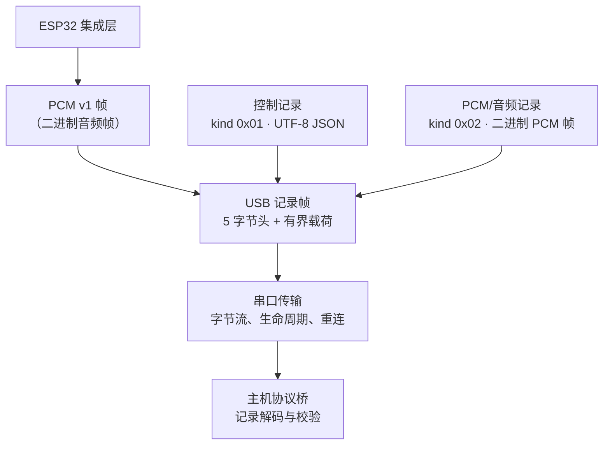

[English](./README.md)

# ESP32 USB Voice Terminal

这是一个从已完成的 ESP32-S3 桌面语音终端项目中提取出的公开参考实现。它聚焦于二进制帧、USB 串口传输、协议边界和主机端可靠性，而非复现完整的语音应用。

其中值得关注的工程问题是：如何让字节流足够可靠地承载混合的控制与音频流量——定义有界记录、从分片或合并读取中干净地恢复、校验每个协议边界，以及将设备特定行为与可复用的主机传输代码分离。

本仓库提供可移植的协议/传输核心，供固件集成使用，并提供 Node.js 主机端参考实现。当前自动化验证为 **OFFLINE**。它不是面向完整语音助手的生产级硬件 SDK，也不代表当前硬件验收。

## 架构



USB 记录边界将控制记录与 PCM/音频记录区分开来，同时允许它们共享同一串口字节流。主机协议桥以增量方式解码记录，校验 v1 控制封装，并分别分派控制载荷和 PCM 载荷。

## 工程价值

- **二进制记录帧：**5 字节、长度前缀的 USB 记录封装将控制数据（`0x01`）与 PCM 数据（`0x02`）分离，并强制执行 1024 字节载荷上限。
- **流式解码器行为：**主机解码器会缓冲分片的头部和载荷，以线路顺序发出已合并的完整记录，保留不完整的尾部，并拒绝格式错误的记录元数据。
- **协议边界校验：**带版本的 JSON 控制封装和固定布局的小端 PCM v1 帧，会在使用前校验版本、类型、帧格式和载荷长度。
- **固件/主机契约：**可移植的 C++ 固件集成源码和 Node.js 主机端源码，共享文档化的 v1 常量、采集/播放 PCM 配置和 USB 记录模型。
- **主机传输生命周期：**通用传输会规范化串口路径、串行化写入、报告错误，并处理有意关闭与意外故障后的确定性重连。
- **复位策略抽象：**通用传输没有默认的控制线行为；调用方可以注入硬件特定的复位策略，而无需将该假设放入协议层。
- **离线可测试性：**伪造串口、注入的复位策略和注入的命令执行，使协议与传输行为无需打开物理设备即可测试。

## 本仓库包含的内容

- v1 控制、PCM 和 USB 记录格式文档；
- 用于 ESP32-S3 固件集成的可移植 C++ 协议和记录帧源码；
- Node.js 协议解析、PCM 帧、USB 记录解码、串口传输和协议桥代码；
- S16LE PCM 播放音量辅助工具；以及
- 确定性的离线测试和静态固件契约检查。

## 本仓库有意不包含的内容

- 原始私有应用或其完整产品配置；
- 生产语音代理集成、ASR/TTS 提供商、运行时状态或凭据；
- 声称具有通用硬件兼容性的物理设备设置说明；或
- 针对采集、播放、USB 复位脉冲或端到端语音回路的当前公开仓库硬件验收。

## 快速开始 — 离线且可复现

需要 Node.js **20 或更高版本**（如 `package.json` 所声明）。

```bash
npm ci
npm test
```

预期结果：**24 个测试全部通过**。这些测试完全离线运行；它们在硬件/进程边界使用伪造端口和注入的执行器，不会访问 COM 端口。

## 可选设备集成参考

此命令仅作为集成参考，不属于公开仓库的自动化验收范围：

```bash
node host/bin/voice-terminal.js --port <serial-path>
```

CLI 要求显式提供串口路径。对于随附的 CH343/ESP32-S3 参考板路径，它会先调用 CH343 复位策略，然后打开通用串口传输；它会打印传输和控制事件，并在 Ctrl+C 时正常退出。仅针对其目标的确切开发板和布线验证该复位顺序。有关串口默认设置、生命周期行为和复位边界，请参阅[串口传输说明](docs/serial-transport.md)。

## 验证与证据

### 公开仓库

| 证据 | 结果 |
| --- | --- |
| 协议与帧测试 | PASS |
| 主机串口传输与桥接测试 | PASS |
| 自动化测试 | 24/24 PASS |
| 证据级别 | **OFFLINE** |

测试套件覆盖协议解析、PCM 和 USB 记录帧、分片/合并输入、传输生命周期行为、桥接分派、伪造串口以及注入的命令执行。它**不会**打开设备、执行物理复位，或证明硬件互操作性。

### 历史私有系统证据

原始私有系统此前已完成真实硬件端到端语音回路：ESP32-S3 麦克风采集、I2S PCM、USB CDC 传输、主机端语音处理，以及 ESP32 扬声器播放。

这只是关于原始私有系统的历史证据。本公开仓库公开的是可复用的协议/传输参考实现，并不复现该私有应用。历史硬件成功不等同于当前公开仓库的硬件验收。

## 仓库结构

- `firmware/esp32-s3/` — 用于固件集成的可移植 C++ 协议和记录帧源码。
- `host/src/` — Node.js 协议、帧、串口传输、协议桥和播放辅助工具。
- `protocol/` — v1 线格式文档。
- `docs/` — 主机串口传输和硬件边界说明。
- `tests/` — 确定性的离线主机测试和固件源码契约检查。

## 许可证

[MIT](LICENSE)
